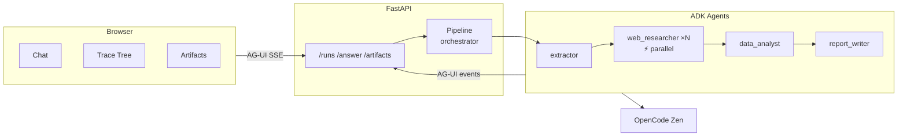
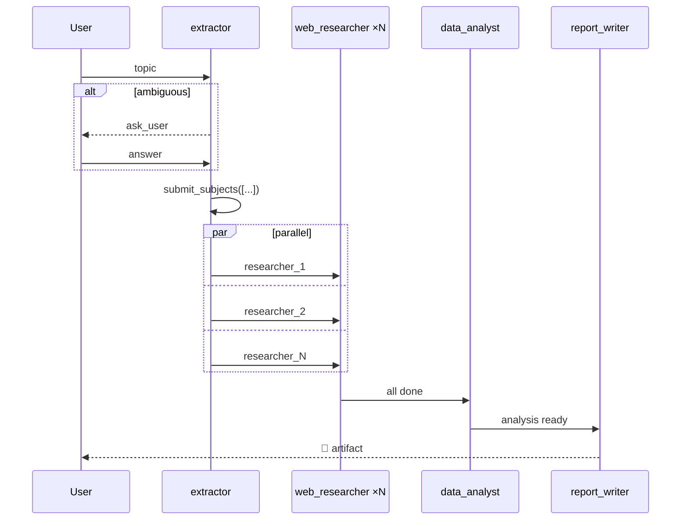
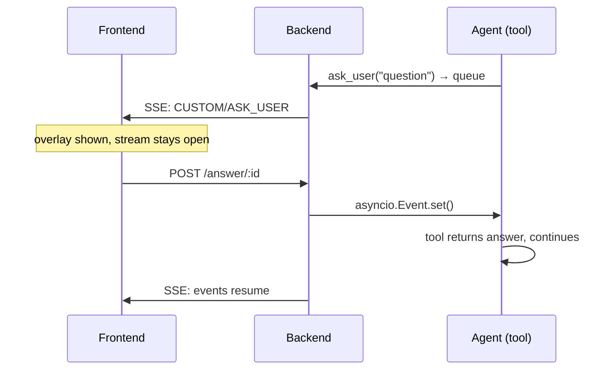
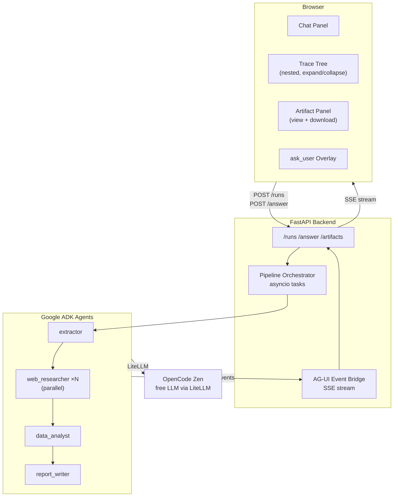
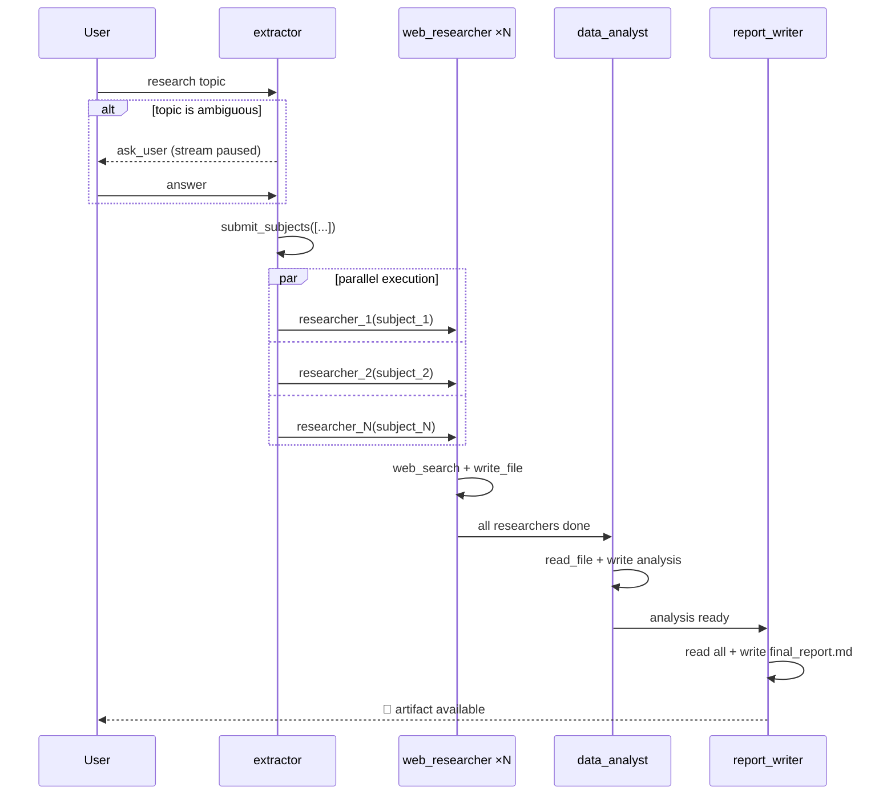

# Deep Analyst — Agent-Transparent Chat Application

A chat application that gives users full transparency into what AI agents are doing in real time. Every thinking step, tool call, parallel execution, and agent handoff is rendered as it happens.

---

## Design

### Tech Stack

| Layer | Technology | Role |
|-------|-----------|------|
| Agent Framework | Google ADK | Agent lifecycle, tool execution |
| LLM Provider | OpenCode Zen via LiteLLM | Free model access (OpenAI-compatible) |
| Agent–UI Protocol | AG-UI | Standardised SSE event stream |
| Backend | FastAPI + Python 3.12 | Pipeline orchestration, SSE endpoint |
| Frontend | React + TypeScript (Vite) | Chat UI, trace tree, artifacts |
| Containerisation | Docker + Nginx | Production deployment |
| CI | GitHub Actions | pytest + vitest on every push |

### System Architecture



### Key Flows

**Research run**



**ask_user flow**



---

## Architecture

```
frontend/          React + TypeScript (Vite)
                   Chat UI · Trace Tree · Artifact Panel · AG-UI Protocol

agents/            Python (FastAPI + custom pipeline)
  agents/          extractor · web_researcher ×N · data_analyst · report_writer
  prompts/         System prompts for each agent (Markdown)
  pipeline.py      Custom async orchestrator (true parallel via asyncio.gather)
```

**Stack:** Google ADK · AG-UI Protocol · OpenCode Zen (free LLM via LiteLLM) · FastAPI · React

### System Architecture



### Pipeline Flow



Each phase emits AG-UI events streamed to the browser in real time.

---

## Prerequisites

- Python 3.12+ · [uv](https://docs.astral.sh/uv/getting-started/installation/)
- Node.js 18+ · npm
- Docker + Docker Compose *(for production)*

---

## Local Development

**1. Clone**

```bash
git clone <repo-url>
cd chat-app-capstone
```

**2. Install dependencies**

```bash
make install
```

**3. Configure**

```bash
cp agents/.env.example agents/.env
# Fill in LLM_API_KEY
```

Get a free API key at [opencode.ai/auth](https://opencode.ai/auth).

**4. Run**

```bash
make be      # backend  → http://localhost:8000
make fe      # frontend → http://localhost:5173
```

---

## Docker

```bash
make docker-up    # build + start (detached)
make docker-down  # stop
```

App available at `http://localhost`.

Logs:
```bash
docker compose logs -f           # all
docker compose logs -f backend   # backend only
```

---

## Environment Variables

`agents/.env`:

```env
LLM_BASE_URL=https://opencode.ai/zen/v1/
LLM_MODEL=opencode/deepseek-v4-flash-free
LLM_API_KEY=your_key_here
```

Available free models on OpenCode Zen: `deepseek-v4-flash-free`, `big-pickle`, `mimo-v2.5-free`, `nemotron-3-super-free`

---

## API Endpoints

| Method | Path | Description |
|--------|------|-------------|
| `GET` | `/health` | Health check |
| `POST` | `/sessions` | Create session |
| `POST` | `/runs` | Start research run (AG-UI, SSE stream) |
| `POST` | `/answer/:id` | Submit ask_user answer |
| `GET` | `/artifacts/:id` | List generated files |
| `GET` | `/artifact/:id/:path` | Download a file |

---

## Project Structure

```
chat-app-capstone/
├── Makefile
├── docker-compose.yml
├── agents/
│   ├── main.py              # FastAPI app, endpoints, logging
│   ├── pipeline.py          # Custom async pipeline orchestrator
│   ├── agui.py              # AG-UI SSE bridge
│   ├── session.py           # In-memory session store
│   ├── logging_config.py    # Logging setup
│   ├── agents/
│   │   ├── extractor.py     # Extracts research subjects
│   │   ├── web_researcher.py # Web search + file write (parallel ×N)
│   │   ├── data_analyst.py  # Reads notes, writes analysis
│   │   ├── report_writer.py # Writes final report
│   │   ├── tools.py         # Shared tools: web_search, write_file, ask_user
│   │   └── shared.py        # LLM config + prompt loader
│   ├── prompts/             # System prompts (Markdown)
│   ├── Dockerfile
│   └── .env.example
└── frontend/
    ├── src/
    │   ├── App.tsx
    │   ├── components/      # ChatPanel, TraceTree, ArtifactPanel, InterruptOverlay
    │   ├── hooks/           # useAGUI.ts (SSE consumer + mock mode)
    │   ├── store/           # reducer.ts, types.ts
    │   └── mock/            # agui-events.ts (pre-recorded mock stream)
    ├── tests/               # decoder.test.ts (14 unit tests)
    ├── nginx.conf
    └── Dockerfile
```

---

## Testing

```bash
make test    # run frontend decoder unit tests (14 tests)
```

Frontend can also run in mock mode (no backend needed):

```bash
make mock    # → http://localhost:5173 with pre-recorded events
```

---

## Known Limitations

- Web search uses DuckDuckGo Instant Answer API — factual topics return better results than niche queries
- Free LLM models on OpenCode Zen may be slow; large research (top 10) can take 2–5 minutes
- Session state is in-memory — restarting the server clears all sessions
- Parallel researchers capped at N=10; max 5 run concurrently (Semaphore) to respect rate limits
